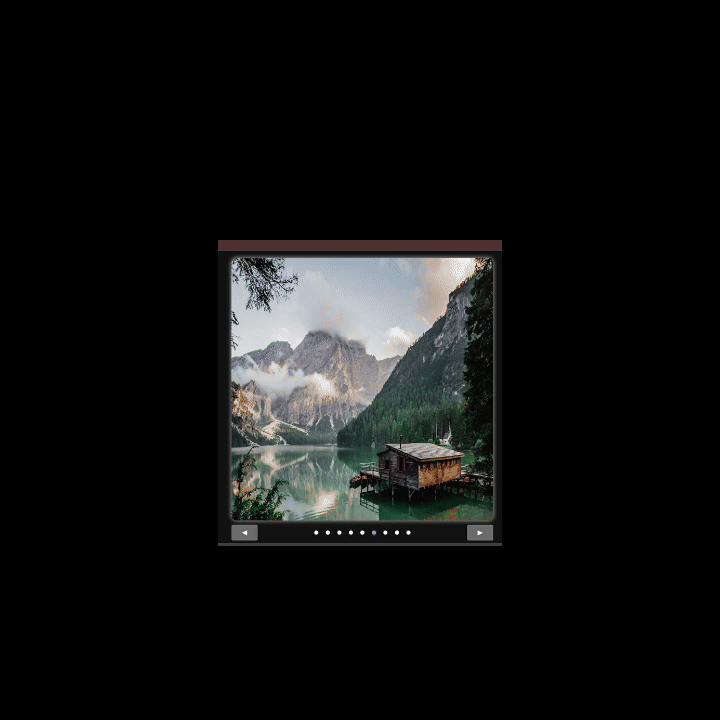

# Image-Carousel

A lightweight, responsive image carousel built with vanilla JavaScript and CSS. It displays a series of images fetched from an external module, allows users to navigate through them using previous/next buttons or navigation dots, and auto-advances every 5 seconds.

---

## 🚀 Features

- Responsive layout
- Left/right navigation buttons
- Clickable navigation dots
- Automatic image rotation every 5 seconds
- Modular structure for easy customization

---

## 🖼️ Preview

---

## 🧠 How It Works
* All images from images.js are dynamically added to the `<main>` element

* Navigation dots are created for each image in `<aside><nav></nav></aside>`

* Buttons (.previous and .next) cycle through the images

* The `slide()` function updates both the image position and the active navigation dot

* The carousel also auto-rotates every 5 seconds using setInterval

## 📄 License
This project is open source and free to use under the MIT License.

## 🙌 Acknowledgements
* [Unsplash](unsplash.com) for the high-quality free images.